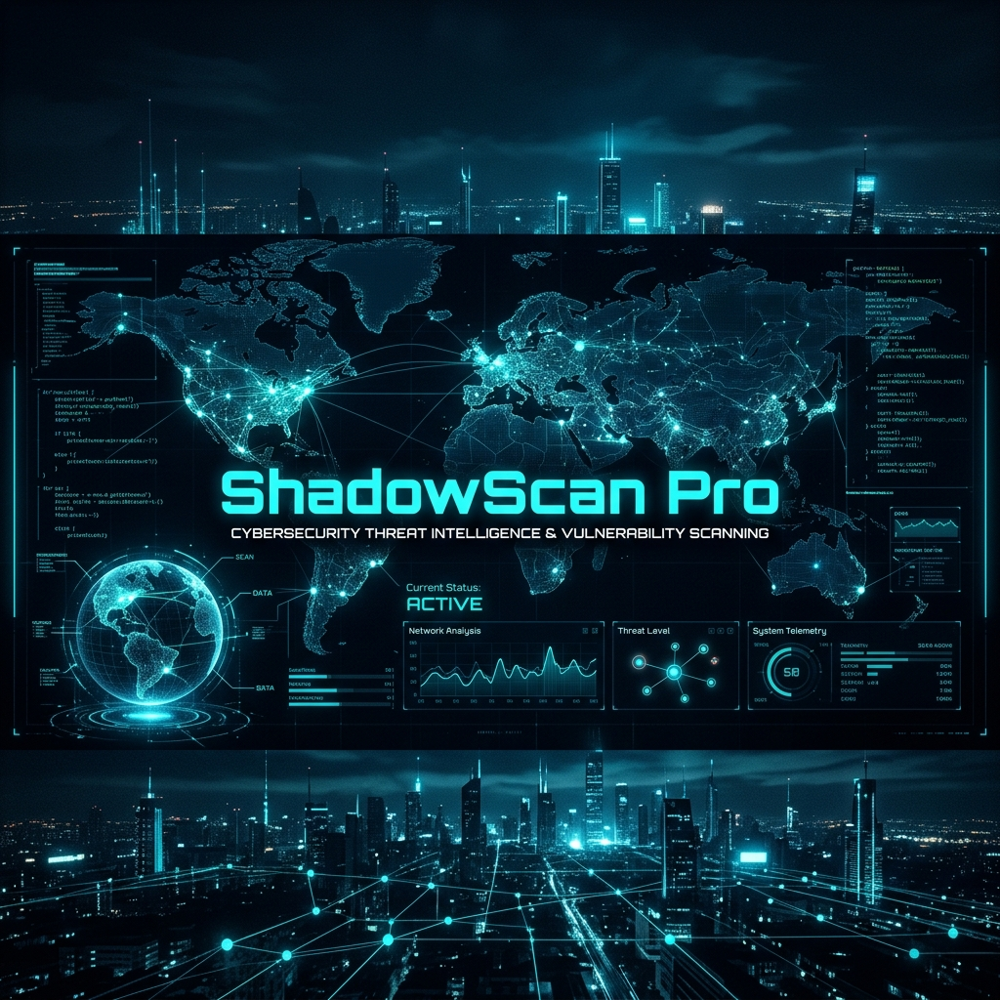
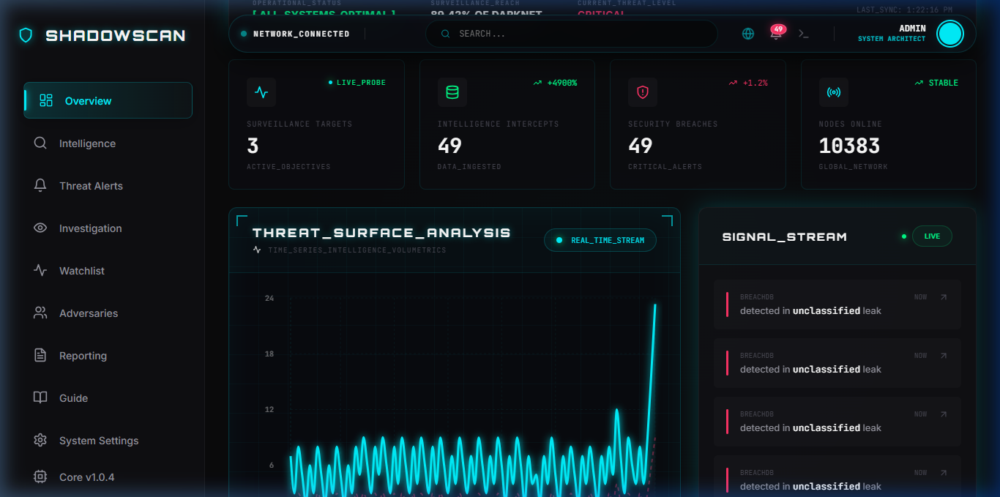
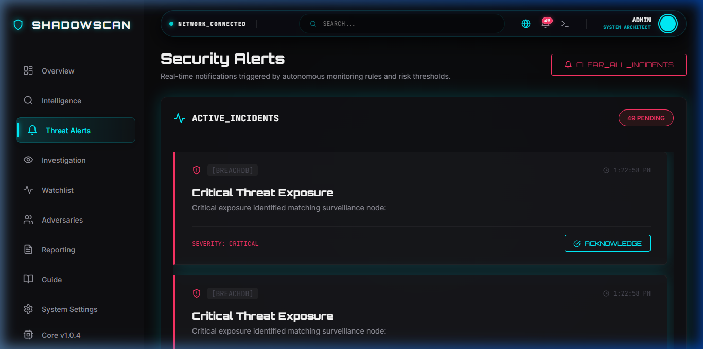
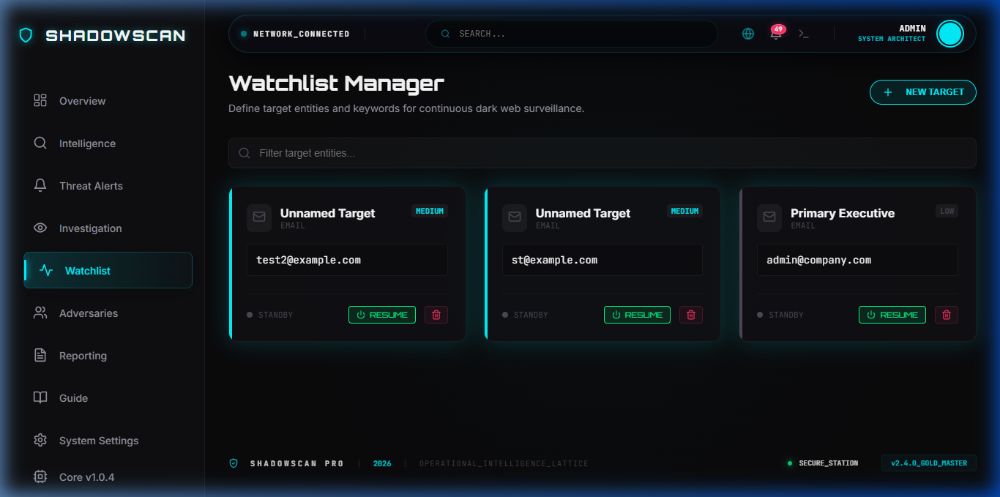
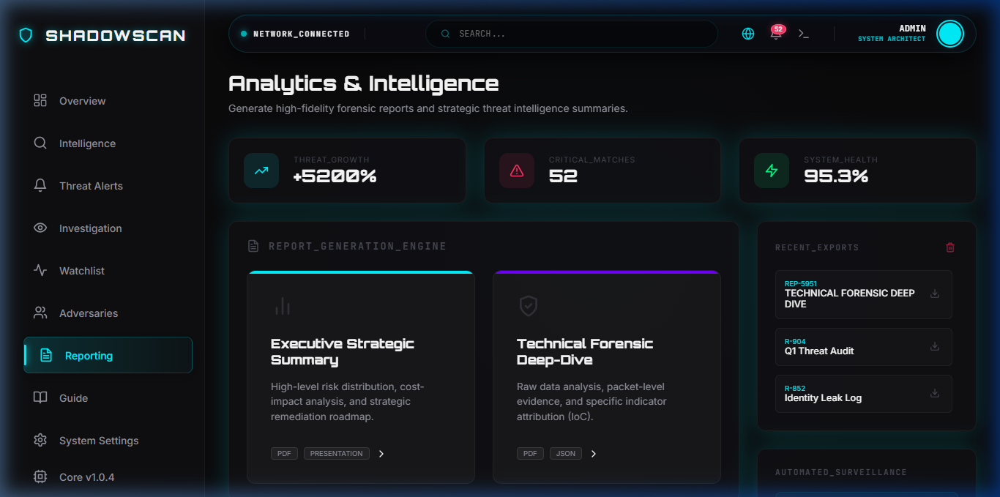
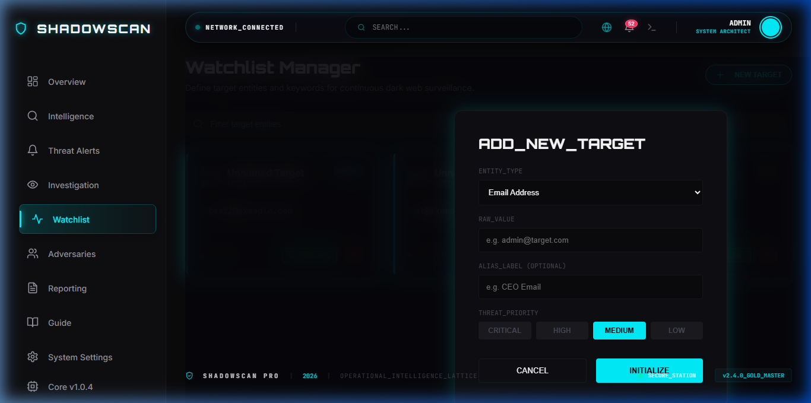
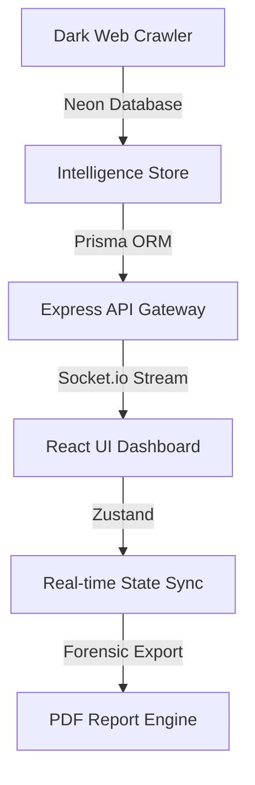

<p align="center">
  
</p>

<h1 align="center">🕵️ ShadowScan Pro</h1>
<p align="center">
  <strong>Advanced Dark Web Intelligence & Tactical Surveillance Platform</strong>
</p>

<p align="center">
  <a href="https://shadowscan-pro.pages.dev/"><strong>Live Demo »</strong></a>
  <br />
  <br />
  
  
  
</p>

---

## 📺 Interface Showcase

<table align="center">
  <tr>
    <td align="center">
      <br />
      <sub><b>Tactical Dashboard: Real-time Telemetry</b></sub>
    </td>
    <td align="center">
      <br />
      <sub><b>Intelligence Feed: Critical Alerts</b></sub>
    </td>
  </tr>
  <tr>
    <td align="center">
      <br />
      <sub><b>Watchlist: Target Surveillance</b></sub>
    </td>
    <td align="center">
      <br />
      <sub><b>Reporting: Exportable Dossiers</b></sub>
    </td>
  </tr>
</table>

<p align="center">
  <br />
  <sub><b>Unified Design System: Centered Neon Modals & Tactical HUD</b></sub>
</p>

---

## 🌌 Project Overview

**ShadowScan Pro** is a production-grade, high-fidelity intelligence workstation designed for real-time dark web monitoring, threat correlation, and forensic reporting. Built with a **"Cyber-Noir"** aesthetic, it combines advanced data visualization with a hardened backend to simulate a professional tactical operations center.

### 🎯 Core Mission
To provide security analysts with a singular, unified interface for tracking data breaches, monitoring adversarial groups, and generating legal-grade forensic evidence.

---

## ✨ Tactical Features

### 📡 Real-Time Intelligence Stream
*   **Live Telemetry**: Direct WebSocket link to surveillance nodes for zero-latency threat updates.
*   **Global Threat Mesh**: 3D planetary visualization of active breach origins and data exfiltration paths.
*   **Network Health**: Integrated hardware monitoring (CPU/RAM/Latency) for the host workstation.

### 🔍 Forensic Workbench
*   **Deep Correlation**: D3.js powered relationship mapping between threat actors, credentials, and leak sources.
*   **Watchlist Management**: Continuous surveillance of specific emails, domains, and keywords.
*   **Automated Countermeasures**: Simulated defensive protocol execution against identified adversaries.

### 📄 Professional Reporting
*   **A4 Dossier Engine**: One-click generation of executive strategic summaries and technical forensic deep-dives.
*   **Digital Integrity**: Every report features an RSA-4096 verified digital signature simulation.

---

## 🛠️ Technology Stack

| Layer | Technologies |
| :--- | :--- |
| **Frontend** | React 18, TypeScript, Vite, D3.js, Recharts, Framer Motion, Lucide Icons |
| **Backend** | Node.js, Express, Socket.io, Prisma ORM |
| **Database** | Neon PostgreSQL (Cloud Native Persistence) |
| **Styling** | Vanilla CSS (Custom Obsidian Design System with Glassmorphism) |
| **Hosting** | Cloudflare Pages (Frontend) & Render (Backend) |

---

## 📂 System Architecture



---

## 🛡️ Installation & Setup

### 1. Clone the Repository
```bash
git clone https://github.com/omkarmahadik96/ShadowScan-Pro.git
cd ShadowScan-Pro
```

### 2. Environment Configuration
Create a `.env` file in the `backend` directory:
```env
DATABASE_URL=your_postgresql_url
PORT=4000
```

### 3. Initialize Backend
```bash
cd backend
npm install
npx prisma generate
npm run build
npm start
```

### 4. Initialize Frontend
```bash
cd ../frontend
npm install
npm run dev
```

---

## ⚖️ License
Distributed under the **MIT License**. See `LICENSE` for more information.

---

<p align="center">
  <br />
  <strong>Developed with precision by <a href="https://github.com/omkarmahadik96">Omkar Mahadik</a></strong>
  <br />
  <em>"Maintaining protocol integrity in a world of digital chaos."</em>
</p>
